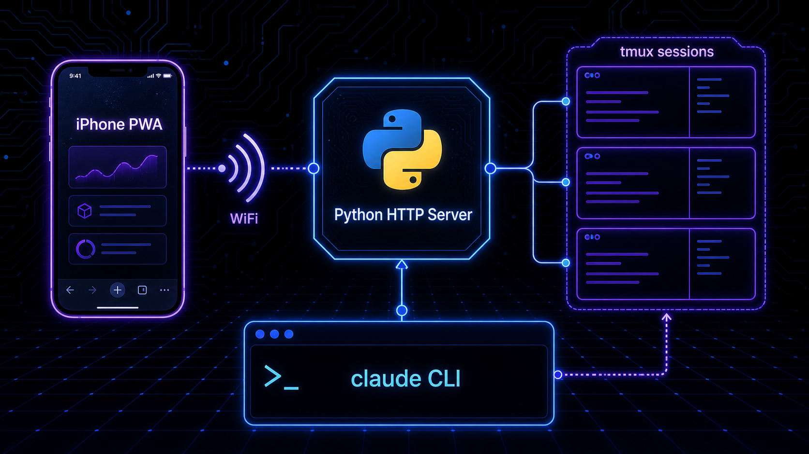
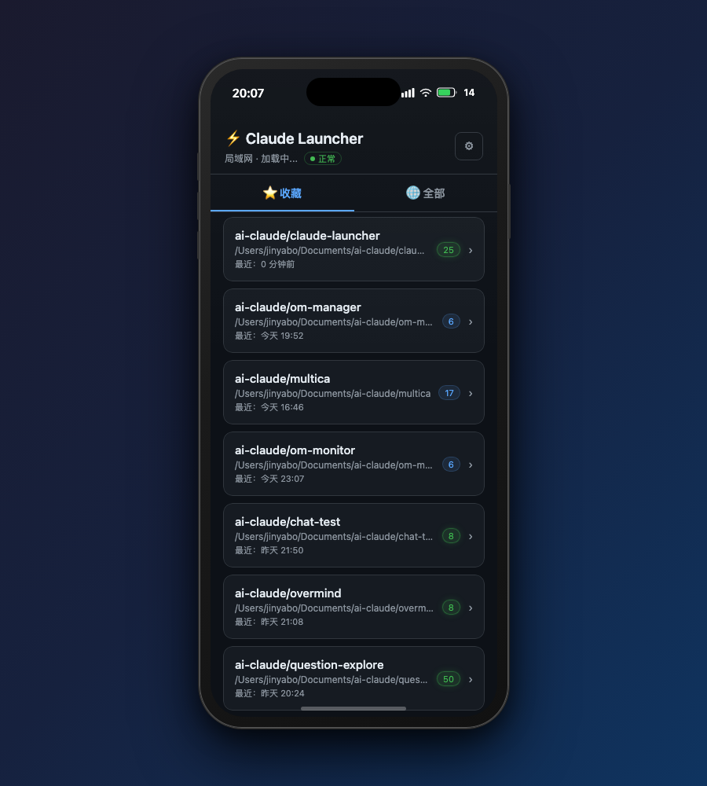
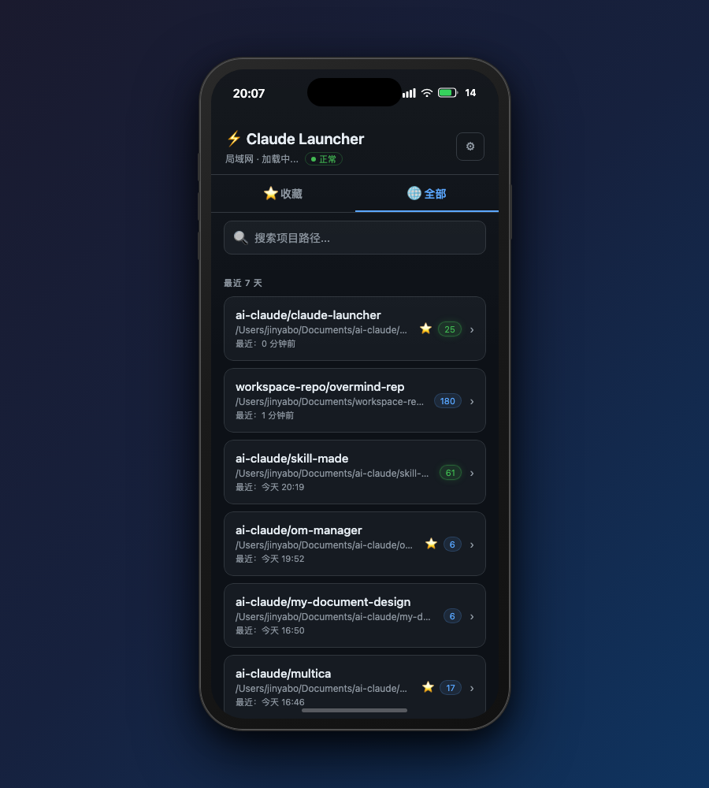
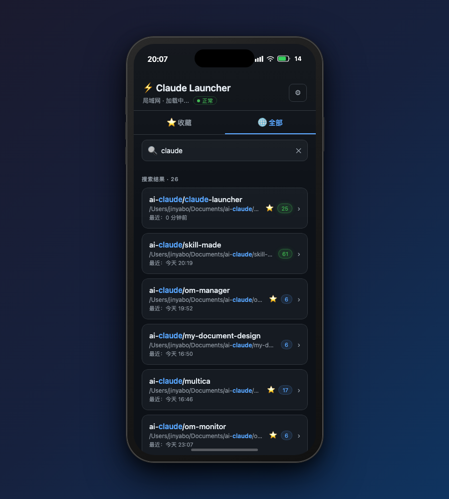
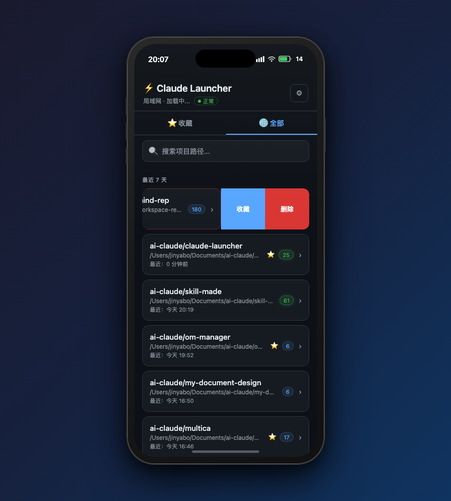
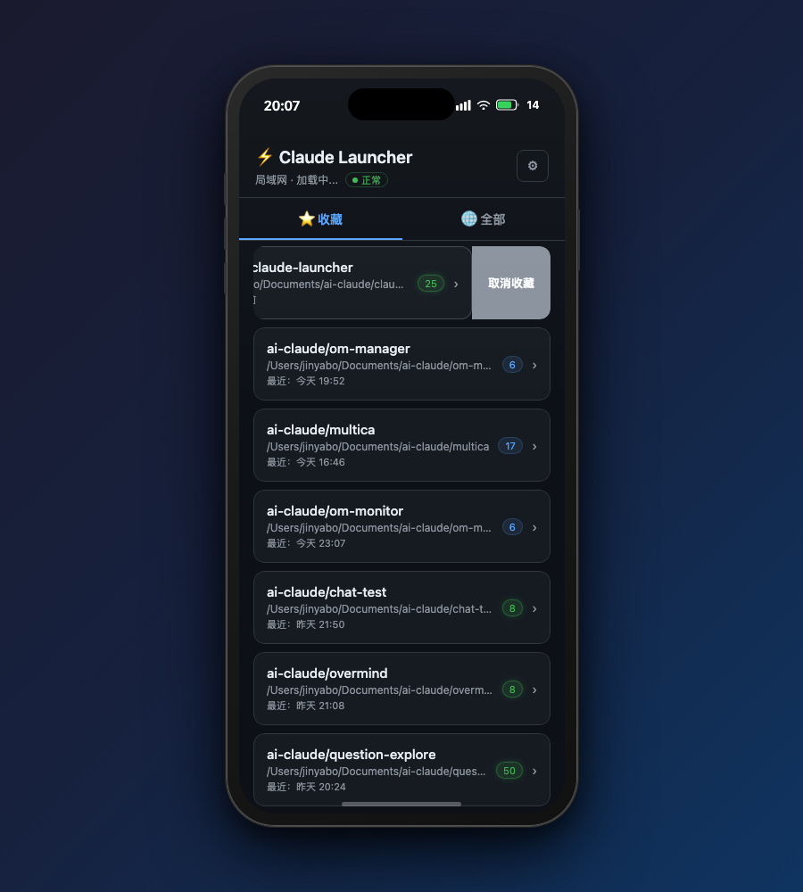
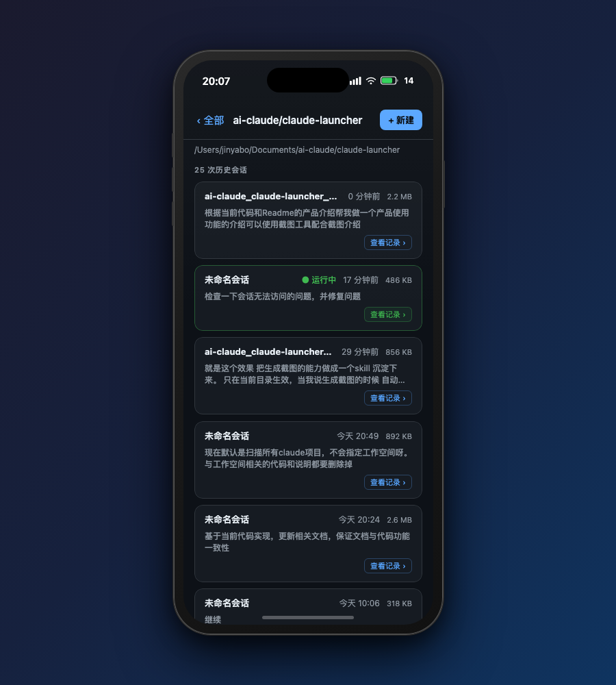
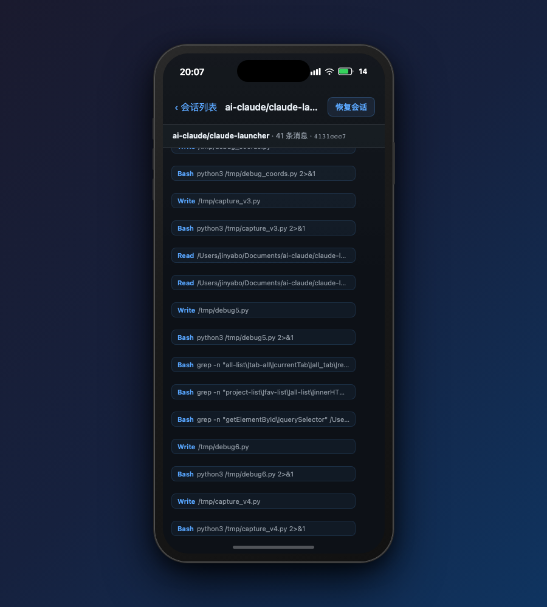
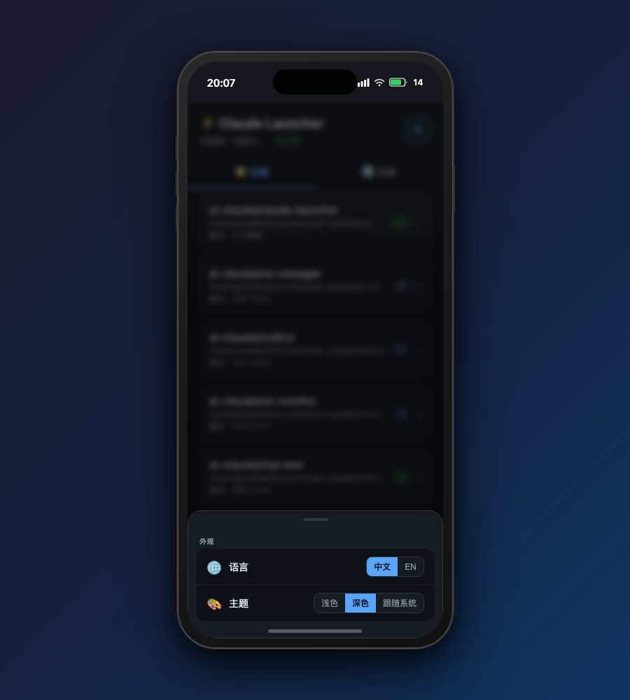
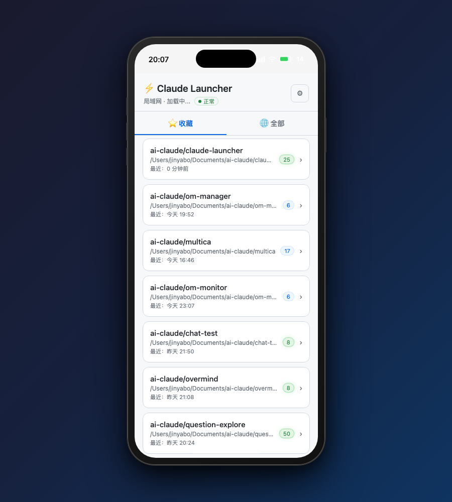

# 我在手机上口喷 Claude 实现了一个小应用，实现了更自由的移动办公

> **副标题：Claude 说能帮你编程，我说行，那你帮我把这个枷锁锯掉**

---

## 一、深夜躺床上，我想干活，但 Claude 不让

故事从一个再普通不过的场景开始。

深夜，我躺在床上，脑子里突然冒出一个想法——想让 Claude 帮我改一个功能，顺手推进一下项目进度。于是我拿起 iPhone，打开 Claude App，准备大干一场。

然后我看到了这个界面：

> **"No active sessions"**

——Remote Control，空空如也。

没有正在运行的会话，手机端就是一块砖。我得爬起来，走到桌子前，打开 Mac，`cd` 到项目目录，输入 `claude`，等它初始化……好了，3 分钟过去了，我的思路也跑了一半。

这就是 Claude Code 的 Remote Control 的根本局限：**它只能让你"遥控"一个已经在桌面发射的会话，但手机端根本无法主动发起任何事情。**

就好比有一辆自动驾驶车，功能强大，但你必须先在车旁边跑 100 米把它启动，然后才能坐进去"遥控"。这合理吗？合理，但很蠢。

---

## 二、Remote Control 的半吊子移动支持

让我们稍微认真点分析一下这个问题。

Claude Code 的 Remote Control 本质上是：你在 Mac 上启动 `claude --remote-control`，然后 iPhone 上的 Claude App 可以识别到这个会话，并继续对话。

这个设计并不差，但它有三个让我抓狂的缺口：

**① 无法在手机端启动新会话**

你有 10 个项目目录，手机端看不到任何一个。你没法说"帮我打开 `~/Documents/ai-claude/my-project`，然后继续干活"——不存在的。

**② 多工作空间切换是奢望**

你上午在 A 项目搞了一会儿，现在想切到 B 项目。对不起，你得回桌面，关掉 A 的会话，重新 `cd` 到 B，重新启动 claude，手机才能连上去。移动办公？更像是每次移动都要先爬回桌面。

**③ 历史对话不可检索**

我 `~/.claude/projects/` 下面有几十个项目，每个项目下面有几十条历史会话。这些对话记录里藏着大量决策上下文、代码片段、设计思路——全都是我和 Claude 共同产出的"知识资产"。

但在手机上，这些东西对我来说就像透明的，根本无从访问。

> Claude 有记忆，但我够不到它。这比失忆更难受——明明知道有，就是无法访问。

---

## 三、一个经常被忽略的细节：工作目录决定了 Claude 的"人格"

在说解决方案之前，我想先聊一个很多人没意识到的关键事实。

**Claude Code 高度依赖工作目录（Working Directory）。**

不只是"在哪个文件夹干活"这么简单。Claude Code 启动时，会从当前目录读取：

- `CLAUDE.md`：项目专属指令——编码风格、架构约束、你希望它注意的所有事项
- `.claude/settings.json`：hooks、slash command、MCP server 的配置
- `.mcp.json` 或对应的 MCP 配置：各种工具接入的定义

**不同项目有完全不同的"人格配置"。**

我有一个内部工具项目，CLAUDE.md 里写了十几条约束——用哪个 API、不能动哪些配置文件、代码风格怎么来。还有一个个人项目，几乎零配置，Claude 放飞自我就好。

这两个项目，Claude 需要以完全不同的方式工作。但如果你在错误的目录启动 Claude——它就只是一个普通 AI，不认识你的 MCP、不读你的 CLAUDE.md、不知道你的项目规范，还以为自己在一个空白环境里工作。

这就是为什么"浏览工作空间并选择启动"不是锦上添花，而是**刚需**。

> 在正确的目录启动 Claude，等于告诉它：「你现在是这个项目的专属助理，带上所有装备，按这套规则干活。」

---

## 四、那就让 Claude 帮我锯掉这根链条

想法很清晰：写一个工具，让手机端可以：

1. 浏览本地所有项目目录
2. 一键在正确的工作目录启动 Claude 会话
3. 查看所有历史对话
4. 直接在手机上发消息，和正在运行的 Claude 交互

需求清楚了，约束也清楚了：
- 不能上 App Store，太麻烦
- 不能有复杂部署，我不想搭数据库、配环境
- 零外部依赖，下载下来就能跑

然后我打开了 iPhone，对 Claude 说：

> "帮我写一个……"

然后它就开始写了。

---

## 五、这不是随便堆的代码，每个选择都有理由



下面说说每个决策背后的思考：

### 决策一：为什么是 PWA？

不想上架 App Store，也不想让用户安装任何东西。

Safari 打开 URL → 加到主屏幕 → 全屏运行，这就是 PWA。它本质上是个网页，但体验上像原生 App。对于一个"给自己用的工具"来说，这是成本最低、部署最快的选择。

而且，PWA 不需要经过 Apple 审核，我改个功能直接刷新就生效。想想看，原生 App 改个 bug 还得等审核——用 PWA 就是这种快感。

### 决策二：为什么用 tmux？

Claude Code 必须活在一个持久终端进程里。如果我直接用 `subprocess.Popen` 启动 claude，HTTP 服务一重启，claude 进程就死了，所有会话断掉。

tmux 解耦了进程生命周期。claude 在 tmux 里运行，launcher 重启、崩溃、更新，都不影响 claude 会话的存活。

> tmux 就是那个"永不落幕的后台舞台"——舞台监督可以换，演员一直在演。

### 决策三：为什么用轮询而不是 WebSocket？

因为简单。

手机端发消息后，前端每隔一秒拉一次 `/api/sessions/live`，看看 JSONL 文件有没有新行。够了。

WebSocket 要维护长连接、处理断线重连、实现心跳——对一个自己用的小工具，这些都是过度设计。**工具复杂了，你就不想维护了。**

### 决策四：零依赖原则

整个后端只用 Python 标准库：`http.server`、`json`、`subprocess`、`threading`。没有 `pip install`，没有 virtualenv，没有 requirements.txt。

macOS 拉下来，`python3 server.py`，完事。

这是我给自己定的一条红线：**所有依赖都是维护负担，能省则省。**

### 决策五：最难的一个——两套 ID 无法直接对应

这是整个系统里最有意思的工程问题。

系统同时有两套标识：

- **tmux session name**（如 `ai-claude_launcher_1041`）：launcher 启动 tmux 时就知道了
- **Claude session_id**（如 `d512e889-...`）：只有 claude 把第一条消息写入 JSONL 之后，才能从文件名推断

也就是说，会话刚启动的时候，我知道 tmux 叫什么名字，但不知道 Claude 的 session_id 是什么。我要等 Claude 先开口，才能把两者关联起来。

这个"时间差"造成两个核心问题：
1. 历史会话列表里哪条是"正在运行"的？——不知道 session_id，无法匹配
2. 手机发消息要投递给哪个 tmux 会话？——不知道 tmux name，无法路由

**解法：`launcher_sessions.json` 作为唯一映射缓存。**

后台线程每 2 秒做一次全量对账：
- session 刚启动 → 写入占位符 `{tmux_name: tmux_name}`，项目立刻显示"运行中"
- Claude 写入第一条消息后 → 占位符替换为 `{session_id: tmux_name}`，会话级状态精确匹配
- session 停止 → 对应条目自动清理

> 这不是过度设计，这是让"实时状态显示"和"消息路由"两件事都能可靠工作的最简路径。

---

## 六、当然也踩了几个坑

**坑一：LaunchD 的 PATH 问题**

我把 launcher 注册成 macOS launchd 服务（开机自启、崩溃自动重启）。结果发现，launchd 启动的进程 PATH 里没有 `~/.local/bin`，导致 tmux 里找不到 `claude` 命令。

会话启动失败，一片茫然，调试了一会儿才定位到。

解法：启动时扫描 `claude` 的绝对路径，写死在调用命令里。以后再也不依赖 PATH 了。

**坑二：Claude JSONL 里不止是对话**

以为读 JSONL 很简单——每行一条消息，role 是 user 或 assistant，直接渲染。

结果发现 JSONL 里还混着：`tool_result`、skill injection 的系统消息、XML 格式的注入内容……早期版本全部渲染出来，用户看到的是一堆 `<context>` 标签和 JSON 块，一片乱码。

花了一段时间写精确的过滤逻辑，只留真实的用户/助手消息，工具调用以可读摘要显示。

**坑三：左滑手势的方向锁定**

左滑卡片可以露出操作按钮，这是 iOS 原生的交互范式。但在 Web 上实现时，问题来了：用户向下滚动列表时，手指也在做水平移动，怎么区分"我在滑动"和"我在滚动"？

解法：`touchstart` 之后，移动超过 5px 时判断主方向。水平为主 → 锁定水平，阻止页面滚动，追踪位移露出按钮；垂直为主 → 锁定垂直，关闭所有已展开的滑动行。

这是 iOS 原生的那套逻辑，移植到 Web 不是"照搬"，是要理解背后的交互意图。

---

## 七、最骚的是——这整个 app 是在手机上口喷出来的

好了，现在说那个让这篇文章真正有意思的部分。

前面所有的决策讨论、架构设计、代码实现、bug 调试——

**全部发生在我的 iPhone 上。**

我用的是 Claude 的 Remote Control 模式：iPhone 上的 Claude App 连接到 Mac 上运行的 claude 会话，我在手机屏幕上输入需求，Claude 在 Mac 上执行，结果实时同步回手机。我只是在手机上"发号施令"。

整个开发流程大概是这样的：

1. 我躺在床上，对 Claude 说"帮我实现一个 PWA，可以……"
2. Claude 开始写，几分钟后问我"你想要 tmux 方案还是……"
3. 我看了一下，说"tmux，理由是……"
4. Claude 继续写，遇到 PATH 问题，主动告诉我"发现一个问题……"
5. 我说"那就扫描绝对路径"，Claude 改了
6. 如此往复，功能一个一个落地

这个过程里，我没有打开过 Mac 屏幕（好吧，偶尔会看一眼）。代码是 Claude 写的，执行是 Mac 完成的，决策是我在 iPhone 上做的。

**用来解决"手机端无法主动管理 Claude"的工具，本身就是用手机端 Claude 造的。**

这是一个完美的闭环：产品验证了产品，方法论验证了方法论。

如果你觉得 Claude 的移动办公体验值得被改善，那么"用 Claude 的移动端来改善 Claude 的移动端"就是最好的证明——它不只是可行的，它是可靠的。

---

## 八、产品功能一览

这个工具叫 **Claude Workspace Launcher**，局域网 PWA，Mac 上运行服务，手机 Safari 打开就能用。

以下是主要功能的截图介绍：

### 收藏 Tab — 你的常用项目首页



把最常用的工作空间钉在首页。绿色的数字 badge 表示会话数量，同时显示当前是否有正在运行的 claude 会话（绿色高亮 = 正在跑）。不用打开任何东西，一眼就知道哪个项目在工作。

### 全部 Tab — 全量工作空间浏览



所有 Claude 历史项目，按最近使用时间分组（7天内 / 更早）。有多少项目、最近改过什么、哪个正在运行——全部一屏搞定。

### 搜索 — 项目多了不怕



关键词实时过滤项目路径。几十个工作空间，输一个词就定位到目标，手机上也能快速操作。

### 左滑操作（全部 Tab）— 拇指不用离开屏幕



卡片左滑，露出蓝色「收藏」和红色「删除日志」两个按钮。这是 iOS 原生的交互范式，移植到 Web 上，手势感觉完全一致。

### 左滑操作（收藏 Tab）— 同样手势，不同语境



收藏 Tab 里左滑，显示「取消收藏」。操作直觉统一，不需要学习新的交互。

### 会话列表 — 三级导航的第二层



点击项目，从右滑入会话列表面板。每条历史会话显示摘要、文件大小、时间，正在运行的会话高亮标注。可以选择「恢复某条历史会话」或「新建会话」。

### 消息详情 + 实时聊天 — 三级导航的第三层



点击某条会话，进入消息详情。完整对话历史在这里——工具调用以可读摘要展示（不让代码淹没正文），文字消息支持 Markdown 渲染（代码块、表格、粗体都有）。

底部有输入框，可以直接发消息，实时和正在运行的 Claude 交互。

### 设置面板 — 底部上拉 Sheet



语言切换（中文 / EN）+ 主题切换（浅色 / 深色 / 跟随系统），底部上拉 Sheet，三秒搞定偏好设置。

### 亮色主题 — 白天也好看



白天户外强光下，深色主题看不清。亮色主题切一下，立刻适应环境。跟随系统模式下，日落之后自动切回深色，不需要手动操作。

---

## 九、Claude 帮我解放了手，我帮它解放了空间

现在，我在任何地方，掏出手机，打开 Safari（或者直接从主屏幕打开 PWA），就能：

- 看到所有工作空间的运行状态
- 在正确的项目目录启动新的 Claude 会话
- 查看任意一条历史对话
- 直接发消息，继续推进

出门等地铁的 10 分钟，午饭后的 15 分钟，在外开会的间隙——都能认真干活了。

这不是什么革命性的东西，就是填了一个本来就应该有的缺口。

但这个缺口被填上之后，Claude Code 的移动体验从"勉强能用"变成了"真的好用"。而这整个工具，是我用 Claude 的手机端做出来的。

**Claude 帮我写了代码，我告诉它写什么。**

如果你用 Claude Code 做过任何认真的项目，你应该感受到过它的强大——它不只是能帮你写代码，它能和你一起思考，一起迭代，一起解决你自己都还没完全想清楚的问题。

而现在，这种能力不再被绑定在桌面前了。

> 这大概就是所谓的正向飞轮：Claude 帮你造出让你更好用 Claude 的工具，工具造好了，你能用 Claude 做更多事，然后 Claude 帮你造出更多工具……

不知道这个飞轮最终会转到哪里，但感觉挺好的。

---

## 附录：架构图 GPT-Image2 生成提示词

如需生成本文的沉浸科技风架构图，使用以下提示词（适用于 GPT-Image2 / DALL-E 3）：

```
一张沉浸式暗科技风格的系统架构信息图，16:9 横版，深黑色背景（#0a0a0a），用于技术文章配图。

主题：Claude Workspace Launcher — 局域网 PWA 移动管理工具系统架构

画面分为三个水平层次，从上到下：

【顶层 — 控制端】
居中放置一台 iPhone 线框图（正视），屏幕内显示"Claude Launcher PWA"界面简图，标签"iPhone Safari PWA"，颜色：霓虹蓝外框。

【中层 — 传输通道】
iPhone 下方延伸一条双向箭头粗连接线，标注"LAN WiFi  HTTP :8765"，箭头两端带数据流粒子效果（青色光点）；连接到中心方块。

【中心服务层】
一个圆角矩形大节点，标题"Python HTTP Server"，内部分两列：
  左列：API 路由标签（小胶囊样式）：/api/projects  /api/start  /api/chat  /api/sessions/live
  右列：小齿轮图标 + 标签"Monitor Thread · poll 2s"
节点边框：霓虹青蓝色，内部有微电路纹底纹。

【右侧 — 会话层】
从中心节点向右延伸 3 条分叉连线，连接到 3 个 tmux 会话小方块：
  tmux: ai-claude_launcher_1041
  tmux: ai-claude_myproject_1305
  tmux: workspace_demo_2147
每个方块内有一个绿色运行指示灯图标。

【底层 — 数据层】
左侧：终端命令行图标，标注"claude --remote-control"；
右侧：文件夹图标标注"~/.claude/projects/[id].jsonl"，文件图标堆叠；
中间连线，标注"JSONL auto-write"。

全图配色：黑色背景 + 霓虹蓝 #00d4ff + 电光紫 #9c6bff + 浅青 #88ffee；连线用发光效果；整体像 PCB 电路板审美。

所有文字清晰可读，专有名词保留英文。宽高比严格 16:9。
```

---

*项目开源于 GitHub，MIT 协议。Mac + tmux + Python 3，零额外依赖，`python3 server.py` 直接启动。*
